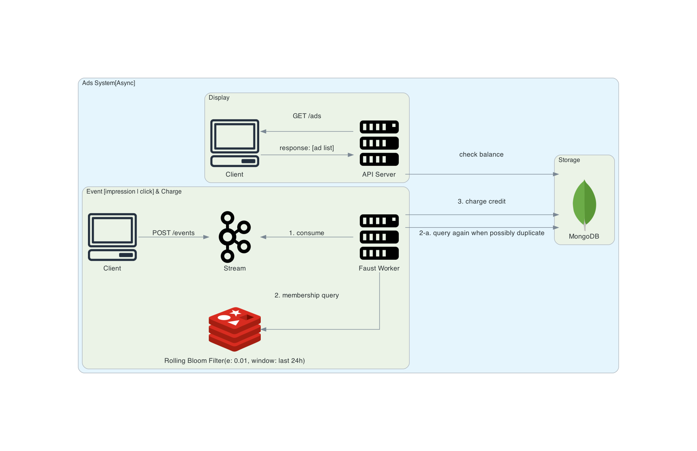

# Ad-Event-Stream
This is an advertising system demo using [faust-streaming](https://github.com/faust-streaming/faust).
- throughput: 20 events per second with 1 consumer

## Diagram

- The actual implementation slightly differs from the diagram above.
  - New event is produced by faust timer to simulate easily.

## Run
```shell
$ docker-compose up -d
$ faust -A main worker -l info
```